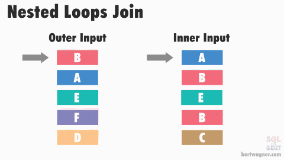

# Physical Plans

In the section on [logical plans](logical-plans.md), examples show what the query engine is planning to query.  Broadly speaking, any data source could be queried with a logical plan.  A physical plan is the processing step that translates the logical plan into concrete read/write operations against the data source.

For example, the logical step may require reading 2 columns from a database table with numerous columns.  The physical step will open the actual data storage medium for reading, and load the raw data from those columns into memory.  The logical step is entirely ignorant of the underlying data structure except for the schema.  The logical plan has no awareness of whether the data source stored data in rows, columns, unstructured formats, and so on.  The physical plan, by contrast, knows precisely how and where to read the requested data.

The physical planning step is aware of those details and orchestrates reading the data in the most efficient way possible.  Physical plans can be a single process, multiple or concurrent processes, distributed processes, and bound to either CPU or GPU for their execution.  Physical plans also determine which strategy is optimal for certain logical steps such as ordering and aggregating data.  

## Physical Expressions
Similar to Logical Expressions composing a logical plan, physical expressions compose a physical plan.  Physical executions are often more complex than the logical expression counterparts.  This is due to the optimization process where the physical expression step will choose and execute a strategy that is best suited for the read/write operation.  

For example, there are numerous strategies for joining data.  Join algorithms may use hashing, sorting, or recursive loops in order to operate with the highest efficiency.  Selecting the right strategy can be difficult depending on query complexity.

Take arithmetic operations as a use case.  Some arithmetic operations are better suited for GPU processing than CPU workloads.  The physical planner would choose the best strategy for the physical calculation based on platform, hardware, resources, etc...

The interface for a physical expression is simple.  An expression contains a schema and is capable of evaluating the expression against a batched subset of data

```c#
internal interface IPhysicalExpression
{
    internal ColumnDataType GetDataType(Schema schema);


    ColumnValue Evaluate(RecordBatch batch, int? schemaIndex = null);
}
```
## Expression Types
Similar to logical expressions, physical expressions come in numerous types.  Physical expression types are analogous to their logical expression counterparts and will act on comparison, arithmetic, and binary computations.

Once the physical expressions are collected into a plan, the physical execution can execute the plan hierarchy against data from the data source.  To do so, physical plans are constructed using a query planning agent.  This is the planning phase in code where the logical plan is converted into a physical plan for execution.

The physical expressions in this project include
- `Aggregate` - physical plan for accumulating data and calculating a single output value
- `Binary` - Performs basic math operations (add, subtract, modulo, and so on) against a batch to produce a boolean value
- `Case` - Evaluates the branches of if/else if/else physical expressions
- `Column` - Creates a column value array from the data source
- `InList` (In) - Evaluates if data in the batch are included in a finite list of values under comparison
- `Like` - Tests if a slice of a data element's value meets a substring pattern criteria
- `Literal` - Provides a single, scalar value
- `Not` (Negate) - Operates on boolean types and inverts the value

These operations collectively represent everything required to execute a physical plan.  Expressions can be combined and nested to form complex queries.


## Record Batches
Physical plans are evaluated on a subset of data elements taking results in chunks, or batches, from the data source.  In Prequel, batching record operations are done using the `RecordBatch` class.  The class contains numerous methods to reorganize batch results, but at its most basic, a batch is a list of column results and the associated schema

```c#
public record RecordBatch
{
    private readonly List<RecordArray> _results = [];

    public RecordBatch(Schema schema)
    {
        Schema = schema;

        foreach (var field in schema.Fields)
        {
            AddResultArray(GetArrayType(field));
        }
    }

    public Schema Schema { get; }

    public int RowCount => _results.Count > 0 ? _results.First().Values.Count : 0;

    public IReadOnlyList<RecordArray> Results => _results.AsReadOnly();
}
```
---

# Building Physical Plans
Creating physical plans is similar to building [logical plans](logical-plans.md) in the sense that an input will drive the output.  For logical plans, a SQL query drives the output plan.  In the case of physical plans, the logical plan is the input, and executable plan steps are the output.

Physical plans are built on a series of executable, nestable steps.  The interface for an executable plan is remarkably simple

```c#
public interface IExecutionPlan
{
    Schema Schema { get; }
    IAsyncEnumerable<RecordBatch> ExecuteAsync(QueryContext queryContext, CancellationToken cancellation = default!);
}
```

Starting with the `PhysicalPlanner.CreateInitialPlan` method, the logical plan is evaluated for the type of plan.  This is where the recursion begins.

```c#
public IExecutionPlan CreateInitialPlan(ILogicalPlan plan)
{
    return plan switch
    {
        TableScan table => table.Table.Scan(table.Projection!),
        Aggregate aggregate => CreateAggregatePlan(aggregate),
        Projection projection => CreateProjectionPlan(projection),
        Filter filter => CreateFilterPlan(filter),
        Sort sort => CreateSortPlan(sort),
        Limit limit => CreateLimitPlan(limit),
        SubqueryAlias alias => CreateInitialPlan(alias.Plan),
        Join join => CreateJoinPlan(join),
        CrossJoin cross => new CrossJoinExecution(CreateInitialPlan(cross.Plan), CreateInitialPlan(cross.Right)),
        EmptyRelation empty => new EmptyExecution(empty.Schema),
        Union union => CreateUnionPlan(union),

        // Distinct should have been replaced by an
        // aggregate plan by this point.
        Distinct => throw new InvalidOperationException("Distinct plans must be replaced with aggregations"),
        _ => throw new NotImplementedException("The physical plan type has not been implemented")
    };
}
```

Generally speaking, the first call to this method will have a projection or aggregation as the input `plan` argument.  

The code simply calls the appropriate builder method based on the logical plan type.  As such, this method can be recursively called for queries, subqueries, and so on.

## Table Scanning
Table scanning is always the final step when building and executing a physical plan.  Scanning is the step during which data will be read directly from the source.  Notice the scan operation cakes in a projection.  This means the scan method will (ideally) read only the data at the projection's indices.  While optimal, that's not always feasible in the case of reading sources like CSV files.  CSV will require line-by-line reading, but the output values can still be limited to those in the projection.

## Aggregation
The aggregation plan will build a set of accumulators, and multiple accumulators can exist within the plan.  Accumulators take in all queried data and run statistical functions on the data.  A `max` aggregator is a simple example where each new value is compared to the previous value.  If a larger value is found, it becomes the new candidate value.  This comparison continues until all data has been accumulated.  The `avg` function operates similarly by summing all values and then dividing the sum by the number of values encountered.

## Projection
The projection step starts by recursively calling the `CreateInitialPlan` function to organize which fields are in the projection in the form of expressions.  Each expression is then mapped by name to the positional index of the column in the underlying data source.  While it may not seem complex on the surface, this becomes increasingly complex when multiple tables from multiple sources are joined together. Each table has unique fields at specific ordinal positions.  This plan step must coordinate the position of each column across all sources to inform the scan operation where data must be read (by index).

## Filtering
The filtering step likewise recursively calls the `CreateInitialPlan` function to organize the input and input schema.  Once organized, the filter step creates a predicate that will evaluate whether data meets the query criteria.  In other words, it enforces the `WHERE` clause criteria against every record in the dataset read from the data source.

## Sorting
A pattern should be obvious by now.  Sorting recursively calls the `CreateInitialPlan` function to organize the input and input schema exactly like the plan and filter steps.  The sort execution plan is an interesting and noteworthy step.  Sorting is a complex topic, and not always immediately intuitive.  In practice, the first column in the sort execution will be sorted in full.  However, what would you expect the behavior to be when a query is sorting across multiple columns?  

```sql
SELECT 
    * 
FROM 
    orders
ORDER BY 
    total_cost asc, 
    date_received desc
```

It seems simple at first, but the complexity quickly emerges.  This query must sort all data first by `total_cost`.  Simple enough.  However, within the sorted results, all data needs to be sorted a second time with `date_received` in descending order *without* changing the order of the first sort.  In other words, it's as if data needs to be grouped by similar `total_cost` values and then sorted by `date_received` within those sort groups.

In .NET, this is similar to using lambdas to and LINQ to take an enumerable object and do the following:

```c#
enumerable.OrderBy(...).ThenByDescending(...)
```

The complexity grows linearly with the sorting demands

```sql
SELECT 
    * 
FROM 
    orders
ORDER BY 
    total_cost asc, 
    date_received desc, 
    sale_price asc, 
    item_count desc
```

Which roughly translates to C# as

```c#
enumerable.OrderBy(...).ThenByDescending(...).ThenBy(...).ThenByDescending(...)
```

To simplify the sorting process, the SortExecution makes use of methods built into the RecordBatch object to reorder results.  The benefit here is that once a batch is sorted, subsequent batches, which may be out of sort order with previous batches, can be merged and sorted into a final result

```c#
public void Reorder(List<int> indices, List<int>? columnsToIgnore = null)
{
    for (var i = 0; i < Results.Count; i++)
    {
        var array = Results[i];

        if (columnsToIgnore != null && columnsToIgnore.Contains(i))
        {
            // Column is already sorted.
            continue;
        }


        array.Reorder(indices);
    }
}
```

Each underlying array object has the ability to sort its own values since comparison differs between data types.  Boolean values will sort `true` then `false` where numeric values must sort in order, and text values must sort alphabetically, possibly with case sensitivity.

## Limit
The limit plan has a simple job.  Reject the first X values (offset) and stop executing after Y values have been received (limit).

The limit execution works by counting individual rows in the result set and slicing batches when too many values are encountered.  Limiting is essentially the gatekeeper for the number of records returned in the final result set.

It achieves this behavior by simply executing the parent plan and yielding each batch after the offset has been reached and until the limit has been reached.  When the final batch straddles the limit, the batch is sliced and the remainder of data truncated.

## Subquery Aliasing
Subqueries are elegant in their implementation.  When encountered, the subquery simply calls the `CreateInitialPlan` method and immediately begins recursion on the subquery.

## Joining
Joining is a topic large enough to be its own chapter.  

The Prequel project employs three join strategies.  

### Cross Joins
The most basic type of join used is a **Cross Join**.  Simply put, a cross join is a cartesian with all the data on the left and all the data on the right.  Prequel uses cross joins in multiple logical executions to merge data sets.  

### Nested Loops
The more simple implementation is a [Nested Loop Join](https://en.wikipedia.org/wiki/Nested_loop_join).

In short a **Nested Loop** join is essentially two foreach loops.  The outer loop consumes data row-by-row on the left hand side of the join clause.  The inner loop executes on each outer row searching for a matching element on data compared to the right hand side of the join clause.  Because of their recursive nature, nested loop joins are not often efficient.



## Hash Joins
**Hash Joins** are the other join type used in the Prequel project.  **Hash Joins** maintain an in-memory key-value pair list (hash table) where each key represents a group of values.  Values being compared are compared by computed hash making the Hash Join a form of aggregation.  Hash joins are typically more operationally efficient than nested loop joins, but they may require a larger memory footprint depending on the size of the input data. 

**Hash Joins** require a two part process to execute.  The first part is the build phase followed by the probe phase.  The build phase always runs first where the build input is read, hashed, and stored in memory.  The Probe phase reads data from the second input (the join's right hand side).  A hash is computed for the input data, compared to the in-memory hash map.  When a match is found, the matching value is added to the aggregated “bucket.”  This process repeats until the data is exhausted.


Thanks to [Bert Wagner](https://bertwagner.com/) for the visualizations 

Bert has excellent videos that go into depth on these join concepts

[Bert's Nested Join Video on YouTube](https://www.youtube.com/watch?v=0arjvMJihJo)

[Bert's Hash Join Video on YouTube](https://www.youtube.com/watch?v=59C8c7p_hII)

## Unions
The union plan in Prequel is another simple execution step, but a useful one.  The step takes multiple plans and executes them in parallel.  The results from each record batch are stored in as concurrent queue.  Once all batches are available, they are returned sequentially to the upstream execution

```c#
public async IAsyncEnumerable<RecordBatch> ExecuteAsync(QueryContext queryContext,
        [EnumeratorCancellation] CancellationToken cancellation = default!)
{
    var batches = new ConcurrentQueue<RecordBatch>();

    await Parallel.ForEachAsync(Plans, cancellation, async (plan, token) =>
    {
        using var step = queryContext.Profiler.Step("Execution Plan, Union, execute");


        await foreach (var batch in plan.ExecuteAsync(queryContext, token))
        {
            step.IncrementBatch(batch.RowCount);


            batches.Enqueue(batch);
        }
    });

    foreach (var batch in batches)
    {
        yield return batch;
    }
}
```